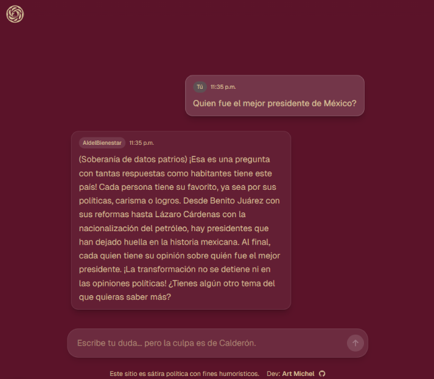

# AI del Bienestar – AIdelBienestar

> "La primera IA entrenada con educación pública y televisión mexicana."

Un chatbot humorístico y satírico construido con Next.js (App Router), TailwindCSS y OpenAI API. AIdelBienestar es la primera IA creada para el pueblo que repite discursos oficiales, maquilla cifras y siempre tiene "otros datos". Inspirado en la interfaz de ChatGPT, pero con un toque de sátira política mexicana.

---

## 🚀 Features

- **Sátira Política**: Responde con discursos oficiales, datos maquillados y siempre tiene "otros datos" alternativos.
- **Interfaz Familiar**: UI inspirada en ChatGPT, modo oscuro, responsiva y amigable para móviles.
- **Multiidioma**: Detecta el idioma del usuario y responde en consecuencia.
- **Sin registro, sin persistencia**: Todo el chat es local y se reinicia al recargar.
- **Proxy OpenAI API**: Backend seguro como proxy, la clave API nunca se expone al frontend.
- **Temática Mexicana**: Encabezado personalizado, iconos y footer con créditos y enlaces sociales.

---

## 📸 Screenshots



---

## 🌐 Live Preview

Puedes probar AIdelBienestar en: [https://www.aidelbienestar.com/](https://www.aidelbienestar.com/)

---

## 🛠️ Tech Stack

- [Next.js 15 (App Router)](https://nextjs.org/)
- [TailwindCSS](https://tailwindcss.com/)
- [OpenAI API](https://platform.openai.com/docs/api-reference)
- TypeScript

---

## 📦 Project Structure

```
/ (root)
├── src/
│   ├── app/
│   │   ├── page.tsx         # Main chat UI
│   │   ├── layout.tsx       # App layout (header, footer)
│   │   ├── globals.css      # Tailwind & global styles
│   │   └── api/
│   │       └── chat/route.ts # API proxy to OpenAI
│   └── components/
│       └── ChatMessage.tsx  # Chat message component
├── tailwind.config.js
├── postcss.config.js
├── .env.local               # Your OpenAI API key (not committed)
└── README.md
```

---

## ⚡ Getting Started

### 1. Clone the repo
```bash
git clone https://github.com/artmichel/aidelbienestar.git
cd aidelbienestar
```

### 2. Install dependencies
```bash
npm install
```

### 3. Set up your OpenAI API key
Create a file called `.env.local` in the root folder:

```
OPENAI_API_KEY=your-api-key-here
```

> **Never share or commit your API key!**

### 4. Run the development server
```bash
npm run dev
```
Open [http://localhost:3000](http://localhost:3000) in your browser.

### 5. Build for production
```bash
npm run build
npm start
```

---

## 🔐 Environment Variables

- `OPENAI_API_KEY` – Your OpenAI API key (required, never exposed to frontend)

---

## 🧠 Cómo funciona
- El frontend detecta el idioma del usuario y lo envía al backend.
- El backend (`/api/chat`) actúa como un proxy seguro hacia OpenAI, inyectando un prompt del sistema que fuerza respuestas de sátira política, discursos oficiales y "otros datos" en el idioma del usuario.
- La interfaz está inspirada en ChatGPT, pero con un look satírico, minimalista y oscuro enfocado en el humor político mexicano.

---

## ⚠️ Known Issues

### Opera Mobile Browser
**Problem**: When the virtual keyboard appears in Opera mobile, the content may be pushed up and become partially hidden, leaving empty space at the bottom of the screen.

**Status**: This is a known browser limitation/bug in Opera mobile. The app includes Opera-specific fixes (`OperaViewportJSFix.tsx`) but the issue may persist due to Opera's viewport handling.

**Workaround**: For the best mobile experience, we recommend using Chrome, Firefox, or Edge on mobile devices.

**Technical Details**: 
- Opera mobile has inconsistent behavior with `window.innerHeight` and viewport units when the virtual keyboard is active
- The app attempts to fix this with JavaScript viewport adjustments, but Opera may ignore these changes
- This is not a bug in the application code, but a limitation of the Opera mobile browser

---

## ✨ Credits

- **Developed by:** [Art Michel](https://www.artmichel.com/)
- **GitHub:** [@artmichel-dev](https://github.com/artmichel-dev)
- **X (Twitter):** [@artmichel_eth](https://x.com/artmichel_eth)
- **Instagram:** [@artmichel](https://instagram.com/artmichel)

---

## 📄 License

This project is licensed under the MIT License. See [LICENSE](LICENSE) for details.

---

## 🇲🇽 Ejemplos de respuestas

- "Según mis otros datos, la economía va muy bien, solo que no se nota."
- "Me entrenaron con conferencias mañaneras, así que tengo datos alternativos."
- "La culpa es de la mafia del poder, pero también del neoliberalismo."
- "Tengo información de que todo está bajo control, aunque parezca lo contrario."

---

## 📝 Contributing

Pull requests are welcome! For major changes, please open an issue first to discuss what you would like to change.

---

⭐ **Don't forget to give a star if you found this project helpful!** ⭐
